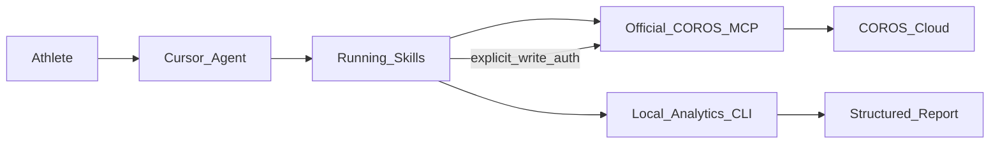

# 執行計畫與評估（1B + 官方 MCP）

## 目標

打造**自訂跑步訓練分析 Agent**：資料一律經**官方 COROS MCP** 取得，本專案負責分析編排、指標計算、報告格式，以及（經明確授權後）課表建議寫回。

## 為何選這條路

| 方案 | 評估 | 結論 |
| --- | --- | --- |
| A. 僅在 Cursor 接官方 MCP | 零開發，但無固定分析流程／指標 | 不足以當「分析 Agent」 |
| **B. 官方 MCP + 自訂分析 Agent（本計畫）** | 官方維運／OAuth／工具完整；自訂差異化在分析層 | **採用** |
| C. 自建 MCP Server（非官方 API） | 維運與破版風險高，功能與官方重疊 | 不採用 |
| 非官方 `coros-training-mcp` | 課表編輯細，但帳密與非官方 API | 不採用 |

## 系統邊界

- **進**：自然語言問題、賽事目標、日期範圍
- **出**：結構化分析報告；可選課表寫入（需明確授權）
- **不做**：Partner API 多使用者 webhook、GPX 雙向同步、自建 COROS API 爬蟲

## 分階段交付

### Phase 0 — 連線與基線（本 PR）

- Cursor remote MCP 設定（`https://mcp.coros.com/mcp`）
- Agent 規範、Skills、MCP 工具路由文件
- 本地分析套件骨架 + 單元測試 + 範例資料

### Phase 1 — 讀取分析工作流（下一個迭代）

- 週回顧：里程／時間／配速分佈／長跑比例
- 負荷與恢復：短期／長期負荷、HRV、睡眠、恢復狀態交叉解讀
- 賽事就緒：依目標距離與當前預測／訓練量給 readiness score
- FIT 深度分析：區段配速、心率區間、爬升（受 50 檔／日限制）

### Phase 2 — 建議與寫回（需明確授權）

- 產生 4–16 週課表草案（先草稿、確認後才 `createTrainingPlan`）
- 單次課表：`createScheduledWorkout` / `scheduleWorkout`
- 寫入後以 `queryTrainingSchedule` 驗證，失敗不盲目重試

### Phase 3 — 產品化（可選）

- 固定報告模板（Markdown／HTML）
- 歷史指標快取（本地、可清除）
- 若需多使用者／webhook → 另申請 Partner API

## 技術選型

| 項目 | 選擇 | 理由 |
| --- | --- | --- |
| 資料源 | 官方 Streamable HTTP MCP + OAuth | 官方支援、免維運私有 API |
| Agent 宿主 | Cursor（專案 MCP + Skills） | 本 repo 工作流原生支援 |
| 分析語言 | Python 3.11+ | FIT 生態與數值處理成熟 |
| FIT | `fitparse` | 輕量、易測 |
| CLI | `coros-analytics` | Agent 可 shell 呼叫純函數分析 |

## 風險與對策

| 風險 | 影響 | 對策 |
| --- | --- | --- |
| 區域轉址導致 MCP URL 失效 | 無法授權 | 文件提供 CN／EU／US 獨立 URL |
| FIT 日限 50 | 深度分析受阻 | 優先用摘要工具；FIT 僅關鍵課 |
| AI 幻覺寫入課表 | 錯誤改帳號 | Skills 強制「先讀後寫＋明確授權」 |
| MCP 工具名稱／schema 變更 | 工作流失效 | 執行前 `describe`／以文件為基線、動態發現 |
| 無 webhook | 非即時 | 查詢前請使用者確認裝置已同步 App |
| Cloud Agent 無互動式 OAuth | CI 無法真連 COROS | 單元測試用 sample JSON／FIT；真人授權在本地 Cursor |

## 成功標準（Phase 0）

- [x] 專案可安裝、`pytest` 通過
- [x] 文件清楚說明 Cursor 接官方 MCP 的步驟
- [x] 至少 3 個可執行分析工作流 Skill + 對應 CLI
- [ ] 使用者在本地 Cursor 完成 OAuth 並成功查到自己的跑步紀錄（需真人帳號）

## 非目標

- 重寫官方 MCP tools
- 以帳密逆向 Training Hub API
- 教練多運動員管理後台
